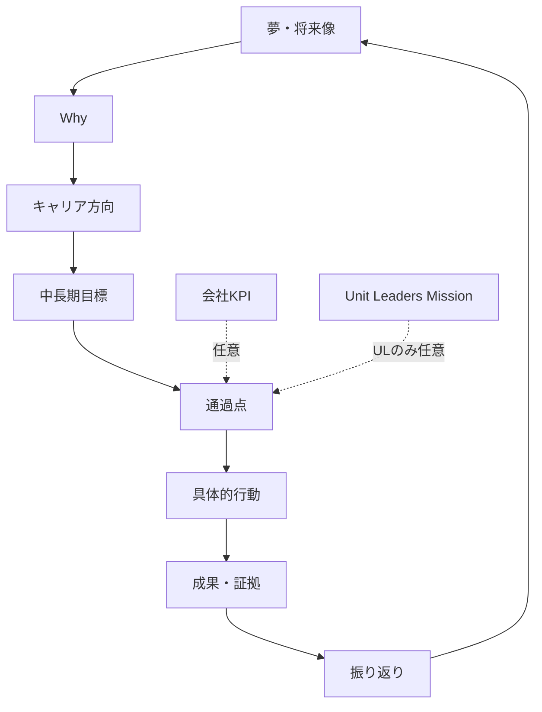

# Phase 1: プロダクト定義

## 1. コンセプト

分散常駐するSES社員が、自分の経験をキャリアへ接続し、納得できる夢・目標・次の行動を継続的に形成できるAI伴走型キャリア・目標管理・1on1支援プロダクト。

## 2. ビジョン

どの客先で働いていても、すべての対象社員が自分の経験を成長へ変換し、自分の言葉でキャリアを選択できる状態をつくる。

## 3. 解決する課題

| ID | 課題 | 解決方針 |
|---|---|---|
| P-01 | 目標がない | 状態診断から適切な開始点を提示 |
| P-02 | 夢・方向が分からない | 経験、感情、価値観から仮説探索 |
| P-03 | 目標設定方法が分からない | 対話型形成とSMART誘導 |
| P-04 | 自己分析不足 | 経験ベースの動的質問 |
| P-05 | Whyが不明確 | 本人の経験・価値観・将来像との接続 |
| P-06 | KPIが目的化 | 本人成長との接続候補を提示し、非接続も許容 |
| P-07 | ULの進捗確認が手作業 | 差分、期限、障害を整理 |
| P-08 | 1on1準備が重い | 共有許可された情報から準備sheetを生成 |
| P-09 | 確認周期が個別 | 目標別・本人別の確認計画 |
| P-10 | 次の支援を毎回考える | 根拠付き質問・行動候補 |
| P-11 | 現場経験がキャリアへ接続されない | 状況・行動・結果・学び・証拠へ構造化 |
| P-12 | 本人とULの認識差 | 両者の情報を分離して確認 |

## 4. 対象ユーザー

### MEMBER

自分の自己分析、夢、Why、キャリア方向、目標、行動、成果、進捗、振り返り、1on1準備を管理する。自分の意思で候補を採用・修正・却下する。

### UL

自UnitのMemberを支援する。本人が共有した情報、目標、進捗、1on1情報を基に対話・支援判断を行う。社員マスタは管理しない。

### ADMIN

社員、Unit、権限、招待、制度、KPI、Unit Leaders Mission、アプリ・AI設定、監査を管理する。組織管理権限は機微情報の無条件閲覧を意味しない。

### EXCLUDED

アプリ利用不可。対象事業部外、異動、招待後に対象外と判明した場合等を表す。

## 5. 目標階層

## 6. 利用ジャーニー

1. 現在状態を確認する。
2. 目標がある人はshort path、ない人は経験・自己分析から始める。
3. 夢がない場合は将来像仮説または探索行動を作る。
4. Why、キャリア方向、通過点を形成する。
5. KPI・Missionとの任意接続を確認する。
6. SMARTな目標と行動・証拠・確認周期を決める。
7. 本人が確定する。
8. 進捗・成果・障害を短時間で記録する。
9. 1on1で本人とULが対話する。
10. 継続、修正、中断、達成を本人が選ぶ。

## 7. 成功指標

### Member

- 現在の目標とWhyを自分の言葉で説明できる。
- 次の行動が分かる。
- 現場経験を成果・学びとして整理できる。
- 目標を必要に応じて修正できる。

### UL

- 1on1準備時間が減る。
- 状況確認ではなく対話へ時間を使える。
- Member別の確認事項と自分の支援taskを把握できる。

### Guardrail

- AI提案の採否・修正率を監視する。
- 非共有情報の漏洩を0にする。
- 通知過多、監視感、AI断定のfeedbackを測定する。
- 入力回数や納得度を人事評価へ転用しない。

## 8. MVP

招待・認証、RBAC、社員・Unit、制度version、自己分析、夢、Why、キャリア方向、目標階層、SMART、行動、成果、進捗、振り返り、目標修正、1on1、通知、AI提案・人間承認、監査を含む。

SSO、SMS、信頼済み端末、録音、リアルタイム1on1 AI、AI人事評価、離職予測、Member ranking、外部SaaS連携はMVP対象外。

## 9. 受入条件

- 夢がなくても開始できる。
- 明確な目標がある人は自己分析をやり直さず開始できる。
- KPIへ接続しない目標を保存できる。
- AI提案を拒否・修正・保留できる。
- 本人確定なしに夢・Why・目標が正式化されない。
- ULは自Unit以外を閲覧できない。
- Memberは自分の個人データを編集できるがアプリ設定を編集できない。
