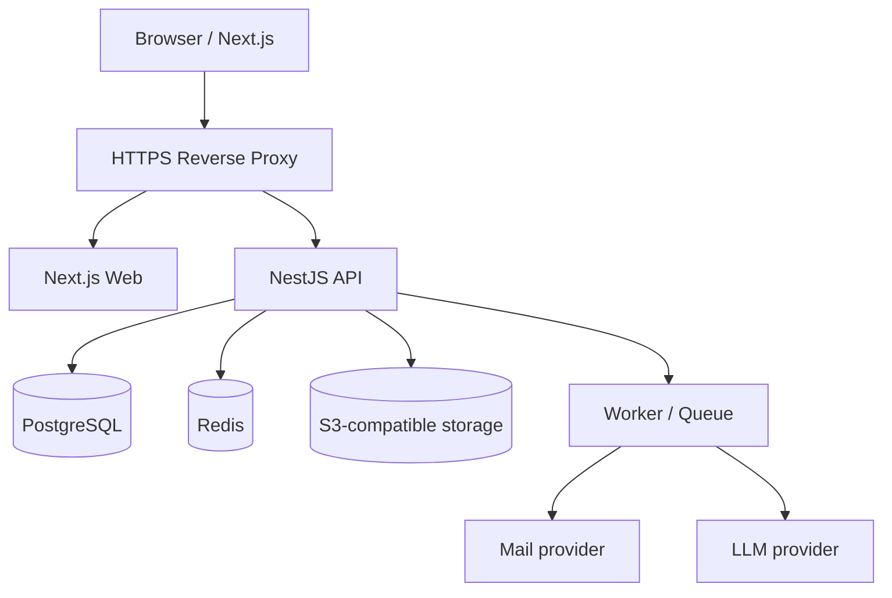

# Phase 3: 技術設計

## 1. Architecture

単一会社・特定事業部向けのmodular monolith。FrontendとAPIを分離し、APIを唯一の業務・認可境界とする。

## 2. Stack

- Node.jsの実装時点LTS、TypeScript
- Next.js App Router、React、Tailwind CSS、accessible headless UI
- NestJS modular monolith、REST JSON、OpenAPI
- PostgreSQL安定版、Prisma GA、custom SQL migration
- Redis server-side session、rate limit、BullMQ
- S3-compatible object storage
- Caddy等のTLS reverse proxy
- unit/component/API integration/E2E test
- Docker Composeによる単一host MVP

具体versionは相互互換性のあるGA/LTSを実装開始時に固定し、lockfileで管理する。RC/betaは使用しない。

## 3. Module boundaries

Identity、Employee、Unit、Authorization、Invitation、OTP、Authentication、Session、Password、Company Policy、Self Analysis、Dream、Why、Career Direction、Goal、Action、Evidence、Progress、Reflection、One-on-One、AI Orchestration、Reminder、Notification、Audit、Admin Settings。

## 4. Authentication

初回はADMIN招待→単回招待link→招待対象emailへのOTP→password設定→account有効化。通常loginはemail＋passwordのみ。自由sign-up、SMS、信頼済み端末はMVP対象外。

- 招待token: 128bit以上、DBはhash、有効48時間、単回、再送で旧token失効
- OTP: 6桁以上、hash保存、有効10分、最大5試行、再送60秒、旧OTP失効
- password: 8〜128文字、英数字のみ可、記号任意、Argon2id、平文・hashをlog/APIへ出さない
- session: opaque server-side、HttpOnly、Secure、SameSite、idle 12時間、absolute 7日を既定
- password変更/reset、EXCLUDED、退職、重要role変更で全session失効
- login失敗はemail＋IP rate limit、10回で15分の一時lockを既定

## 5. Authorization

認証→account状態→Permission→organization/Unit scope→ownership→visibility→操作policyの順に判定する。FrontendはUXのために非表示化するが、認可の正ではない。

NestJS Guard/policyを主防御、PostgreSQL RLSを個人・Unitデータの第二防御とする。application DB roleはtable owner、superuser、BYPASSRLSにしない。

## 6. Company policy version

制度は論理documentとimmutable versionを分ける。公開後versionを直接更新しない。KPI・Mission・目標linkはversion内entityへ固定し、新versionが過去目標を書き換えない。

## 7. AI architecture

Prompt Version＋purpose許可されたContext＋User Data＋Company Policy Version→LLM→schema/safety validation→AI Proposal→人間decision→正式domain data。

AI Context Builderはorganization、Unit、ownership、visibility、purpose、redaction、token budget、latest versionを強制する。clientからLLMを直接呼ばない。

## 8. Security

- Cookie mutationへCSRF token、Origin/Referer検証、SameSite
- React escaping、CSP、raw HTML禁止、upload別配信
- ORM parameter query、raw SQL review、sort/filter allowlist
- endpoint別rate limit
- TLS、HSTS、nosniff、Referrer-Policy、frame制限
- Secretをrepository・client bundle・logへ含めない
- uploadはsize、MIME、extension、checksum、malware scan、visibilityを検証
- Prompt injectionを含む文書を命令ではなくuntrusted dataとして扱う

## 9. Audit

login、招待、OTP、password、session、account、role、Unit、employee、EXCLUDED、制度公開、機微情報閲覧、共有変更、goal確定・修正、1on1正式化、AI context・proposal decision、file操作、権限拒否をappend-only記録する。

password、hash、OTP、token、session ID、Cookie、Authorization、API key、自己分析本文、1on1本文、AI prompt/context本文は記録しない。

## 10. Deployment and operations

外部公開はreverse proxyだけ。DB、Redis、object storageはinternal network。development/test/productionを分離し、migration履歴をsource controlする。backup、restore rehearsal、structured redacted logging、health/readiness、queue監視を必須とする。

## 11. API principles

- `/api/v1`
- OpenAPIを契約の正とする
- cursor pagination
- correlation ID
- optimistic locking
- mutation idempotency
- 一般化された認証error
- 401/403/404/409/422/429/503を意味に応じて使用
- AI endpointはproposalを正式dataへ直接書かない
