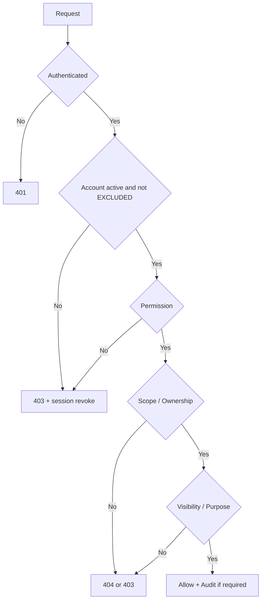

# RBAC・Unit・Ownership・Visibility仕様

## 1. 判定model

RoleはPermission集合の既定値。最終認可はPermission＋organization scope＋Unit scope＋ownership＋visibility＋resource state＋purposeで判定する。

## 2. Permission catalog

### Administration

`app.configure`、`unit_content.edit`、`employee.read`、`employee.manage`、`unit.manage`、`role.manage`、`invitation.manage`、`policy.read_applicable`、`policy.manage`、`mission.manage`、`ai.configure`、`audit.read`、`security.investigate`。

### Personal domain

`self_analysis.read_self/write_self`、`dream.read_self/write_self`、`why.read_self/write_self`、`goal.read_self/write_self`、`evidence.read_self/write_self`、`one_on_one.read_self/prepare_self`、`notification.manage_self`。

### Support domain

`unit.read_assigned`、`member.support_assigned`、`goal.read_shared`、`goal.support_assigned`、`one_on_one.manage_assigned`、`career_sensitive.read_shared`。

## 3. Role defaults

| 能力 | ADMIN | UL | MEMBER | EXCLUDED |
|---|---:|---:|---:|---:|
| アプリ全体設定 | yes | no | no | no |
| Unit支援content編集 | yes | assigned Unit | no | no |
| 社員マスタ管理 | yes | no | no | no |
| Unit・role・招待管理 | yes | no | no | no |
| 制度・KPI・Mission管理 | yes | no | no | no |
| 適用制度閲覧 | yes | yes | yes | no |
| 自分のcareer data | yes | yes | yes | no |
| 自Unit Member支援 | all Unit | assigned Unit | no | no |
| 共有済み機微情報 | purpose付き | assigned Unit/purpose付き | self | no |
| audit | permission保有ADMIN | no | no | no |

ADMIN roleだけで`career_sensitive.read_shared`を自動付与しない。必要な管理者へ限定assignmentし、閲覧理由を監査する。

## 4. Visibility

- `PRIVATE`: 本人のみ
- `SHARED_WITH_ASSIGNED_UL`: 本人＋現在の対象UL
- `SHARED_WITH_ONE_ON_ONE_PARTICIPANTS`: 当該1on1参加者
- `UNIT_SHARED`: Unit内で共有可能な非機微content
- `POLICY_APPLICABLE`: 制度適用対象者
- `ADMIN_RESTRICTED`: 専用Permission保有者

自己分析、夢、Whyは既定`PRIVATE`。目標・progressも本人が共有を確認する。共有済みsummaryと元の非共有本文を分離する。

## 5. Unit scope

ULはrole assignmentの有効期間内かつ対象Unitのactive membershipを持つMemberだけを支援する。異動でassignment/membershipが失効した時点から新規閲覧を禁止する。過去1on1記録の引継ぎは共有記録に限定し、個別policyに従う。

Memberは自分のresourceだけを操作する。`employeeId`をclient入力として信頼しない。

## 6. Database RLS

対象はself analysis、experience、insight、dream、Why、goal、action、evidence、progress、reflection、one-on-one、AI proposal、notification。

DB transaction-local contextへactor、organization、active Unit、Permission、purposeを設定し、connection poolのrequest間漏洩を防ぐ。application DB roleにowner/superuser/BYPASSRLSを与えない。

## 7. Required negative tests

- 別Unit ULの直接URL・API・search・export
- 他MemberによるIDOR
- EXCLUDEDの既存session
- role変更直後のsession
- Unit異動前後
- 非共有自己分析のUL summary・AI context混入
- ADMINの権限外機微閲覧
- DB RLS単独の拒否
