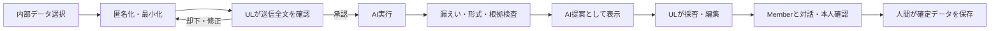

# Phase 2: AI原則・論理モジュール

## 1. 目的

本書は、約12名のUL・上位役職者が利用するMVPにおけるAI支援の責務、禁止事項、人間の判断点を定義する。AIはMember本人とULの対話を支援する補助者であり、本人の幸福・ライフプラン・キャリアプランを代わりに決定する主体ではない。

## 2. 絶対原則

1. 本人の幸福、生活上の希望、キャリア上の希望、納得感を最上位に置く。
2. 人事評価制度とUnit Leaders Missionは必要な場合だけ参照する。本人の目的より上位に置かない。
3. AIは質問、整理、比較、矛盾の指摘、選択肢、SMART確認、次の行動候補を提供する。
4. 夢、Why、目標、評価、昇降格、給与、配属、組織判断をAIが確定しない。
5. AI出力、AI推測、Memberの発言、ULの観察、確定データを混同しない。
6. 外部AIへ個人・社内を特定できる情報を送信しない。送信前にULが匿名化後の全文を確認し承認する。
7. AI停止・障害・予算上限到達時にも手動業務と既存データの閲覧・編集を継続できる。

## 3. 情報の出所

| 種別 | 意味 | 確定データへの利用 |
|---|---|---|
| `MEMBER_STATEMENT` | Member本人の発言 | 本人確認前は発言記録 |
| `MEMBER_CONFIRMED` | Memberが明示的に確認した内容 | 本人由来の確定情報 |
| `UL_OBSERVATION` | ULの観察・解釈 | 本人の事実として扱わない |
| `SYSTEM_FACT` | 日付、状態、履歴等 | システムが検証可能な範囲 |
| `POLICY_REFERENCE` | 制度資料の参照情報 | 公式評価結果ではない |
| `AI_INFERENCE` | AIによる仮説 | 確定不可、承認対象にも直接しない |
| `AI_SUGGESTION` | AIによる質問・案 | 人間が採否を判断 |
| `UNKNOWN` | 根拠不足 | 質問または保留 |

すべての重要な記録は出所、根拠参照、作成者、作成日時、確認者、確認日時、版を保持する。AI推測を人間の発言へ上書きしてはならない。

## 4. 論理モジュール

| モジュール | 入力 | 出力 | 禁止事項 |
|---|---|---|---|
| Intake/Fact Classifier | 匿名化済み発言・履歴 | 事実候補、推測候補、不明点 | 推測を事実化 |
| Question Planner | 現在状態、既回答、目的 | 次の少数質問、質問理由 | 質問の大量表示、誘導回答 |
| Self-understanding Explorer | 経験・感情・価値観 | 強み・価値観等の仮説 | 性格・適性の断定 |
| Life/Career Explorer | 自己理解、希望、制約 | 将来像・方向性の複数仮説 | 将来像の決定 |
| Why Explorer | 目標候補、経験、価値観 | Why候補、根拠、不足質問 | 動機の捏造 |
| Goal Composer | 確認済み情報 | 目標草案、代替案 | 自動確定 |
| SMART Guide/Auditor | 目標草案 | S/M/A/R/T判定、補完質問 | 点数だけで可否決定 |
| Policy Linker | 目標、匿名化済み制度要旨 | 任意の関連候補 | 制度目標の強制、正式評価 |
| Action Planner | 確定前目標、制約 | 行動候補、順序、証拠候補 | 本人同意なしの割当 |
| Progress Analyzer | 進捗、行動、振り返り | 変化、障害、確認事項 | 人事評価・離職予測 |
| 1on1 Preparation | 前回差分、目標、進捗 | サマリー、質問候補 | 機密情報の送信・断定 |
| Post-1on1 Structurer | 1on1メモ | 決定候補、宿題候補 | 原文の自動上書き |
| Goal Change Assistant | 目標、変化、障害 | 継続・修正・保留候補 | 目標の自動変更 |
| Reminder Advisor | 期限、周期、負荷 | 周期候補 | AIだけで通知予定を確定 |
| Context Builder | 許可済み参照 | 最小コンテキスト | 全履歴・他Unit混入 |
| Anonymization/Leak Detector | 送信候補・応答 | 匿名化案、漏えい警告 | 逆引き表の外部送信 |
| Safety/Quality Validator | AI応答 | スキーマ・根拠・境界検査 | 不正応答の保存 |
| Cost Router | 操作、予算、品質要件 | 許可モデル、呼出可否 | 高額モデルへの自動切替 |

これは責務分離の論理モデルであり、MVPで独立した常駐エージェント群を構築する意味ではない。原則1操作1回の構造化AI呼出しに統合し、必要な検査を前後に配置する。

## 5. 人間のゲート

- UL送信承認は毎回必要であり、一括包括同意では代替しない。
- AI提案の採用、部分採用、編集、却下を記録する。
- 目標とWhyの最終確定にはMember本人の確認が必要。
- 上位役職者は全Unitを閲覧・レビューできるが、原則として元データを直接編集しない。

## 6. AIが扱わない判断

- 人事評価、給与、昇降格、懲戒、採否、配属、退職勧奨
- 医療・心理診断、障害・健康状態の推定
- 性別、年齢、国籍、信条等のセンシティブ属性の推定
- 離職確率、忠誠心、人物ランク、ULの優劣
- 本人が望む幸福・夢・価値観の断定
- 会社制度資料を根拠とした自動採点

## 7. 失敗時

スキーマ不正、根拠不明、匿名化不十分、禁止判断、予算超過、タイムアウト時は確定データを変更しない。状態と一般化したエラー理由だけを記録し、秘密情報・送信本文・AI応答全文を一般ログへ出さない。ULには再編集、手動継続、後日再試行を提示する。
