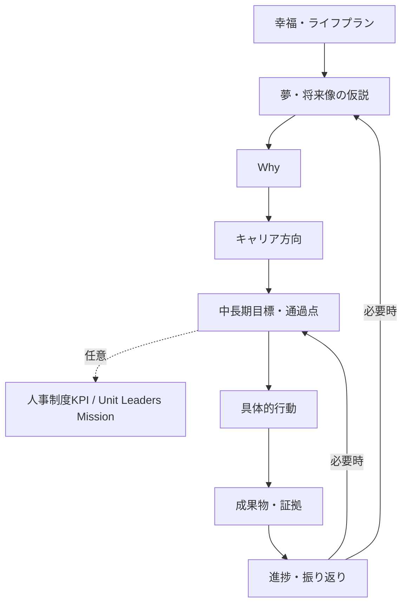

# Phase 2: 自己理解・将来像・Why・目標形成ロジック

## 1. 対話設計

質問は一度に1〜3問とし、既回答、未確定事項、心理的負荷、目標形成上の情報価値から次問を選ぶ。回答拒否、保留、「分からない」、後日回答を正常な選択肢とする。同じ論点を言い換えて執拗に尋ねない。

### 探索領域

- 過去の経験、成功・失敗、達成感・不満、楽しかった・苦痛だった仕事
- 得意・苦手、他者から評価されたこと、本人が気づいていない可能性のある強み
- 興味・関心、価値観、譲れないこと、生活上の希望・制約
- 現在と将来のスキル、客先現場・自社活動での課題
- 理想の生活、働き方、役割、将来の人物像

AIは発言の引用可能な要約、仮説、反証例、不明点を分ける。センシティブな内容は本人またはULが`通常`、`機密`、`AI送信禁止`に分類できる。

## 2. 入口別フロー

| 状態 | 導線 | 完了の目安 |
|---|---|---|
| 夢・目標がない | 経験→感情→価値観→望む状態→避けたい状態→将来像仮説 | 複数仮説を本人が比較可能 |
| 方向はあるが曖昧 | 具体場面→役割→得たい変化→制約→通過点 | Whyと最初の通過点が説明可能 |
| 明確な目標がある | 目標を直接入力→Why→将来像との整合→SMART→行動 | 自己分析全件を必須にしない |
| 維持・保留したい | 現状維持理由→再確認時期→小さな観察項目 | 無理に目標を作らない |

## 3. 将来像探索

将来像は最初から確定させず`仮説`として保存できる。AIは少なくとも「ありたい状態」「避けたい状態」「関心領域」「活かしたい強み」「生活上の条件」を組み合わせ、根拠付きで2〜4案を提示する。本人は採用、組合せ、修正、却下、保留を選べる。

将来像の確信度は本人の自己申告を中心とする参考指標で、低いことを問題扱いしない。AIの推定値を本人の確信度として保存しない。

## 4. Why探索

重要な目標ごとに以下を保持する。

- 本人の言葉によるWhy
- 根拠となる過去経験・価値観・将来像
- AIが提示した仮説と根拠参照
- 本人が承認・修正・却下した内容
- Why納得度（本人自己申告）と確認日
- 未解決の矛盾・不明点

標準質問順は「なぜ達成したいか」「なぜ重要か」「達成で何が変わるか」「経験・価値観・将来像との接続」「外部から与えられただけではないか」。深掘り回数を固定せず、本人が十分説明できる、負荷が高い、機密領域に入る場合は止める。

## 5. 目標階層

制度への関連付けは0件でもよい。関連付ける場合も「本人の成長にどう役立つか」を明示し、制度項目自体を最上位目的にしない。個人評価資料とULの組織評価資料は独立した参照軸とする。ManagementカテゴリのKPIは`draft`表示し、確定制度として扱わない。

## 6. SMART誘導と監査

対話中に自然に以下を引き出し、確定直前に再監査する。

| 軸 | 質問 | 判定 |
|---|---|---|
| Specific | 誰が、何を、どの範囲まで行うか | `OK/要改善/不足` |
| Measurable | 何を証拠に達成と分かるか | `OK/要改善/不足` |
| Achievable | 現状・資源・障害から実行可能か | `OK/要改善/不足` |
| Relevant | 幸福・将来像・Whyとどうつながるか | `OK/要改善/不足` |
| Time-bound | 期限・中間確認日はいつか | `OK/要改善/不足` |

判定は根拠と改善質問を伴う。不足時は補完対話へ戻す。探索型目標など合理的理由がある場合、本人とULが理由、代替確認方法、次回見直し日を記録して例外確定できる。AIの合計点だけで確定可否を決めない。

## 7. 確定前の本人確認

1. 自分自身が望む目標か。
2. なぜこの目標なのか自分の言葉で説明できるか。
3. 将来像・生活上の希望とつながるか。
4. 制度上の要求を含む場合、自分の成長との接続を理解しているか。
5. 達成基準は明確か。
6. 期限または合理的な例外理由が明確か。
7. 次に何をするか分かるか。

MemberがアプリへログインしないMVPでは、ULが対話時に各項目を確認し、Memberの確認方法、確認日時、本人の言葉を記録する。UL自身がMemberの意思を代替してはならない。

## 8. 目標状態

`draft → ai_proposal_generated → ul_reviewed → awaiting_member_confirmation → revision_or_hold → member_confirmed → finalized → active → completed/cancelled`

- AI実行なしで`draft`から`ul_reviewed`へ進めてもよい。
- `awaiting_member_confirmation`から不一致時は`revision_or_hold`へ移す。
- `member_confirmed`は確認証跡が必須。
- 確定後の変更は上書きせず新版を作成し、旧版、変更理由、本人確認を残す。

## 9. 参考指標

Why納得度、目標納得度、将来像の確信度、達成可能性、現在進捗、本人自己評価は本人申告として保存する。SMART品質は軸別判定として保存する。AIが補助指標を出す場合は`AI参考`、根拠、算出版を表示し、心理状態・能力・評価の断定に使用しない。
