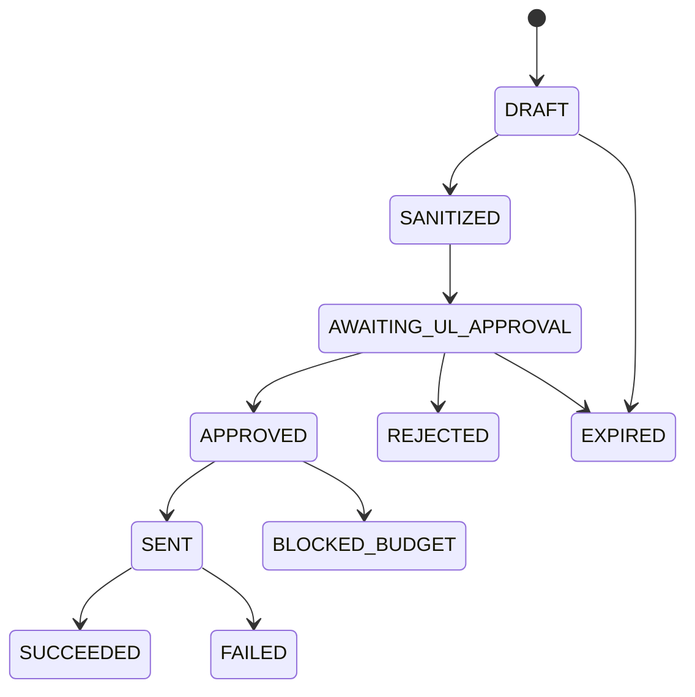

# Phase 2: AI契約・状態遷移・承認証跡

## 1. 共通リクエスト契約

AI実装は自由文を直接永続化せず、次の論理項目を持つ構造化契約を使用する。

| 項目 | 内容 |
|---|---|
| operation | AI操作種別 |
| actor / scope | 実行UL、Unit、対象Member |
| purpose | 今回の単一目的 |
| input_refs | 内部データ参照と出所 |
| context_snapshot | 匿名化後の送信内容の版 |
| redaction_report | 除外・一般化・警告 |
| prompt/schema version | 再現性のための版 |
| model policy | 許可モデル、上限、外部送信条件 |
| estimated cost | 送信前見積り |
| approved_by/at | ULの送信承認証跡 |
| idempotency key | 重複実行防止 |

## 2. 共通レスポンス契約

`status`、`facts_used`、`unknowns`、`questions`、`suggestions`、`warnings`、`source_refs`、`confidence_note`、`schema_version`、`usage/cost`を持つ。永続化対象は検証済み構造だけとし、表示用文章も対応する構造項目へ紐づける。

AIが出した確信度は「出力の根拠充足に関する参考」であり、Memberの心理や能力の確率ではない。根拠のない数値を生成させない。

## 3. 操作別出力

| operation | 必須出力 | 人間の確定点 |
|---|---|---|
| `QUESTION_PLAN` | 次問、理由、参照、不足領域 | ULが質問を採用・編集 |
| `FUTURE_HYPOTHESIS` | 2〜4仮説、根拠、反証、不明点 | Memberが選択・修正・保留 |
| `WHY_EXPLORE` | Why候補、根拠、確認質問 | Memberの言葉で確認 |
| `GOAL_DRAFT` | 目標案、代替案、前提、制度関連の有無 | ULレビュー後Member確認 |
| `SMART_AUDIT` | 軸別状態、理由、補完質問、例外候補 | 人間が補完・例外承認 |
| `ACTION_PLAN` | 行動、順序、期限候補、証拠候補 | UL/Memberが決定 |
| `ONE_ON_ONE_PREP` | 差分、進捗、障害、質問・行動候補 | ULが会話内容を判断 |
| `ONE_ON_ONE_POST` | 決定候補、宿題、確認待ち | ULが原文と照合して確定 |
| `GOAL_CHANGE` | 継続・修正・保留候補、影響 | Member確認後に新版化 |

## 4. AIリクエスト状態

承認後に送信本文、モデル、目的が変わる場合は承認を失効させる。失敗時の自動再試行は一時的通信障害に限り最大1回、同一ペイロード・同一費用上限で行う。それ以外は再承認を要求する。

## 5. AI提案状態

`PENDING → ACCEPTED | PARTIALLY_ACCEPTED | REJECTED | SUPERSEDED`

- 採用時はAI提案そのものを「人間確定」へ昇格させず、採用内容から新しい人間所有レコードを作成する。
- 元提案、編集差分、採否理由、判断者、判断日時を追跡できる。
- 新しい入力・新しい提案で古い提案を`SUPERSEDED`にできるが削除しない。

## 6. 再現性・重複防止

操作、匿名化済み入力スナップショット、プロンプト版、スキーマ版、モデル版から実行指紋を作る。同じ指紋の連打は既存結果を提示し、ULが明示的に再生成した場合のみ新実行とする。モデルまたはプロンプト変更後は別結果として保持する。

## 7. バリデーション

- JSON等の構造スキーマ、列挙値、文字数、参照ID、必須根拠を検証する。
- 引用・根拠参照は入力スナップショットに存在するものだけ許可する。
- 禁止判断、PIIらしき情報、プロンプトインジェクション追従を検査する。
- 一部だけ妥当でも自動で部分保存しない。ULへ妥当部分と問題部分を分離表示する。

## 8. 監査イベント

最低限、`AI_REQUEST_PREPARED`、`AI_REQUEST_APPROVED/REJECTED`、`AI_REQUEST_SENT`、`AI_RESPONSE_ACCEPTED/REJECTED`、`AI_SUGGESTION_APPLIED/PARTIALLY_APPLIED`、`AI_BUDGET_BLOCKED`、`AI_BOUNDARY_VIOLATION`を記録する。秘密情報や本文を監査イベントへ埋め込まない。

## 9. 権限

ULは自Unitの対象だけAI処理できる。上位役職者は全Unitの結果を閲覧・レビューできるが、既定ではAI送信や元データ編集を行えない。管理権限が必要なモデル・プロンプト・費用上限変更はPhase 3のRBACで別権限にする。
