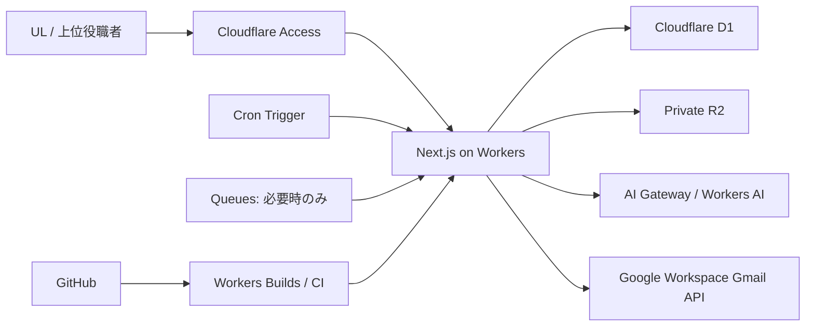

# Phase 3: システムアーキテクチャ・技術スタック

## 1. 採用構成

MVPは、Cloudflare Workers上のNext.jsフルスタックアプリケーションを単一デプロイ単位とする。約12人の社内利用、最小運用費、AI停止時の手動継続を優先し、NestJS常駐API、PostgreSQL、Redis、BullMQ、Vercelを採用しない。

## 2. 技術スタック

| 層 | 採用 | 理由 |
|---|---|---|
| Web | Next.js App Router + TypeScript | UI、SSR、Route Handlerを一体化し小規模運用を単純化 |
| Runtime | Cloudflare Workers + `@opennextjs/cloudflare` | Next.jsの主要機能をWorkersで利用可能。常駐サーバー不要 |
| Package | pnpm、Node.js LTS | lockfileを一意にしCIを再現可能にする |
| Validation | Zod | API境界、フォーム、AI構造出力を同じスキーマで検証 |
| DB | Cloudflare D1（SQLite） | 12人規模、低運用コスト、Workers Binding、Time Travel |
| DB access | Drizzle ORM + SQL migrations | 型付きクエリと明示的migration。認可はアプリ層で強制 |
| Object storage | Private Cloudflare R2 | HTMLスナップショット、添付、DBエクスポートを非公開保存 |
| Authentication | Cloudflare Access + Google Workspace | 会社アカウントを認証元にし、アプリパスワードを持たない |
| Authorization | アプリ内RBAC + Unit scope + confidentiality | Access認証だけでは業務権限を決めない |
| AI | AI Gateway + Workers AIを初期候補 | 費用・利用量を統制。モデルはPoCまで未確定 |
| Scheduled work | Cron Trigger + D1 job/outbox | 低頻度通知・匿名化・バックアップを低コストで実行 |
| Queue | Cloudflare Queues（条件付き） | 再試行量や外部送信が増えた場合だけ導入。MVP初期必須ではない |
| Mail | Gmail API adapter | WorkersのHTTP `fetch`で送信し、SMTPソケット依存を避ける |
| Observability | Workers logs/metrics + D1監査 | 本文・Secretを除外し、運用イベントと業務監査を分離 |

実装開始時は、CloudflareがサポートするNext.js安定版、OpenNext adapter、Node.js LTSを互換性表で確認し、正確なversionをlockfileとADRへ固定する。`latest`を本番再現性の根拠にしない。

## 3. アプリケーション境界

単一リポジトリ内で次の論理層を分離する。

- `presentation`: App Router画面、Server Components、Client Components
- `api`: `/api/v1` Route Handlers、入力検証、HTTP変換
- `application`: ユースケース、トランザクション、状態遷移
- `domain`: Entity、値、Policy、権限判定、計算規則
- `infrastructure`: D1、R2、Access JWT、AI、Gmail、Clock、Holiday

UIからD1/R2へ直接アクセスしない。Server Actionを使用する場合も同じapplication serviceと認可を通し、独自の裏口を作らない。

## 4. 環境

| 環境 | 用途 | データ |
|---|---|---|
| local/CI | 自動テスト | 合成データのみ。実データ禁止 |
| preview | PR確認 | 本番と別D1/R2/Access。合成データのみ |
| production | 社内運用 | 本番D1/R2/Access |

環境間でDatabase ID、R2 bucket、Access AUD、AI設定、秘密を分離する。本番データをpreviewへコピーしない。

## 5. 同期・非同期処理

- CRUD、本人確認、目標状態変更、共有発行は同期処理とする。
- AIはUL承認後に実行し、長時間化する場合はrequest recordを作り非同期化できる。
- 通知、期限確認、保持期限匿名化候補、バックアップエクスポートはCronからjob/outboxを処理する。
- jobは冪等キー、attempt、next_attempt_at、lease、結果を持つ。
- 同じ通知・メール・匿名化を二重適用しない。
- Queuesを採用する場合はat-least-onceを前提に同じ冪等キーを使用し、DLQを設定する。

## 6. 共有HTML

共有時点の確定データから不変スナップショットを生成し、Private R2へ保存する。公開R2やR2 presigned URLを直接使わず、Workerの共有エンドポイントがD1のトークンハッシュ、有効期限、失効状態を確認してR2から配信する。これにより7〜30日の期限と即時失効を統一して強制する。

## 7. メール判断

会社がGoogle Workspaceを利用しているため、初期実装はGmail APIによる専用送信アカウントを採用する。Cloudflare WorkersはSMTP port 25を使用できず、SMTP relayはポート、TLS、認証、送信元IP条件のPoCが必要になるため基本経路にしない。既存SMTPの利用が会社要件になった場合は同じ`MailPort`の別adapterとして実装し、port 465/587、TLS、資格情報、送信制限をpreviewで検証する。ドメイン全体の委任は権限が大きいため、可能なら専用送信アカウントの限定OAuthを優先する。

## 8. 採用しないもの

- Memberログイン、アプリパスワード、OTP、信頼済み端末
- NestJS別サービス、Redis session、BullMQ
- D1の代わりのPostgreSQLや旧RLS設計
- R2 public bucketによる個人HTML公開
- AIの自律ツール実行、AIのみの通知日程決定
- 本番データを用いたpreview/AI PoC

## 9. 公式仕様による成立判定

- Next.js App Router、Route Handlers、SSR等はOpenNext adapterでWorkers上に配置可能。
- D1は小規模MVPの容量・クエリ上限内に十分収まるが、DB単位で逐次処理されるため巨大一括更新を避ける。
- D1 Time Travelはプランにより7日または30日であり、要件の30日復旧を満たすにはWorkers Paidまたは日次R2 exportが必要。
- Cloudflare Access JWTはヘッダーの存在だけでなく署名、issuer、audience、期限を検証する。
- Queuesはat-least-onceで順序保証がないため、採用時は冪等化が必須。

## 10. Phase 4・実装前の確定事項

- 画面単位のServer/Client Component分割
- AI PoCによるmodel/provider
- Google Workspace管理者によるAccess、送信アカウント、OAuth設定
- Free/Paid planの最終選択と月額見積り
- OpenNext互換versionの固定

## 11. 公式参照

- [Next.js on Cloudflare Workers](https://developers.cloudflare.com/workers/framework-guides/web-apps/nextjs/)
- [Cloudflare D1 limits](https://developers.cloudflare.com/d1/platform/limits/)
- [D1 Time Travel and backups](https://developers.cloudflare.com/d1/reference/time-travel/)
- [Cloudflare Access application token validation](https://developers.cloudflare.com/cloudflare-one/access-controls/applications/http-apps/authorization-cookie/application-token/)
- [Cloudflare Queues delivery guarantees](https://developers.cloudflare.com/queues/reference/delivery-guarantees/)
- [Cloudflare Workers TCP sockets](https://developers.cloudflare.com/workers/runtime-apis/tcp-sockets/)
- [Gmail API overview](https://developers.google.com/workspace/gmail/api/guides)
