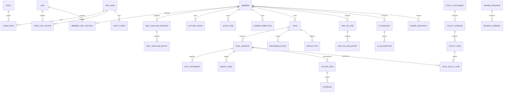

# Phase 3: データモデル・ER設計

## 1. モデル原則

- IDはアプリ生成のUUID/ULID文字列とし、連番を外部公開しない。
- 時刻はUTC ISO 8601またはepochで保存し、表示時にAsia/Tokyoへ変換する。
- 業務上の削除は原則soft delete/status変更とし、保持期限処理だけ匿名化・物理削除する。
- 確定目標、制度版、共有スナップショットを後から上書きしない。
- 自由記述には`provenance_type`、`confidentiality`、`ai_send_policy`を付与できる。
- D1の外部キー、UNIQUE、CHECK、NOT NULLを有効化し、アプリ検証だけに依存しない。

## 2. ER概要

## 3. Identity・組織

| Table | 主要列 | 制約・用途 |
|---|---|---|
| `app_users` | id, access_subject, email_normalized, display_name, status, last_login_at | `access_subject`とemailを一意。`ACTIVE/SUSPENDED/REVOKED` |
| `roles` | id, code | `SYSTEM_ADMIN/EXECUTIVE/UL`をseedで固定 |
| `user_roles` | user_id, role_id, valid_from, valid_to | 複合一意。履歴を保持 |
| `user_unit_scopes` | user_id, unit_id, scope_type, valid_from, valid_to | ULの編集対象。Executiveはglobal scope |
| `units` | id, code, name, type, status, valid_from, valid_to | Unit統合・分割でも過去行を保持 |
| `members` | id, employee_ref, display_name, status, joined_on, left_on, leave_status | ログイン主体ではない。必要最小限の個人情報 |
| `member_unit_history` | member_id, unit_id, is_primary, started_on, ended_on, source, decided_by | 期間重複と主所属の整合をserviceで検証 |
| `member_status_history` | member_id, status, started_on, ended_on, reason_code | 在籍、休職、退職、対象外、再入社 |

`employee_ref`は社内照合に必要な非公開識別子であり、共有・AIへ出さない。Memberのメール、住所、電話、生年月日等はMVPで保持しない。

## 4. 本人理解・将来像

| Table | 主要列 |
|---|---|
| `self_analysis_sessions` | id, member_id, route_type, status, started_at, completed_at |
| `self_analysis_entries` | session_id, domain, prompt_text, response_text, provenance_type, confidentiality, ai_send_policy, source_one_on_one_id |
| `value_items` | member_id, label, description, status, provenance_type, confirmed_at |
| `future_visions` | member_id, version_no, statement, status, confidence_self, valid_from, confirmed_at, supersedes_id |
| `career_directions` | member_id, future_vision_id, statement, status, confirmed_at |

`prompt_text`はULが実際に使用した質問を保存するが、AIシステムPromptとは別物である。`答えたくない/不明/保留`をresponse statusで表現し、空文字と混同しない。

## 5. 目標・Why・SMART・行動

| Table | 主要列 |
|---|---|
| `goals` | id, member_id, parent_goal_id, current_version_id, lifecycle_status, owner_type |
| `goal_versions` | goal_id, version_no, title, description, target_date, success_criteria, review_cycle, status, change_reason, created_by, confirmed_at |
| `why_statements` | goal_version_id, statement, provenance_type, evidence_refs_json, satisfaction_self, status, confirmed_at |
| `smart_audits` | goal_version_id, audit_version, s/m/a/r/t_status, reasons_json, exception_reason, audited_by_type, created_at |
| `goal_confirmations` | goal_version_id, method, result, member_words, confirmed_at, recorded_by |
| `action_items` | goal_version_id, title, due_at, status, sort_order, expected_evidence, confirmed_at |
| `evidence` | action_id, member_id, kind, description, r2_object_key, occurred_on, confirmed_by |
| `progress_entries` | goal_id, recorded_at, state, percent, self_rating, note, provenance_type, confidentiality |
| `reflections` | goal_id, period_start, period_end, outcome, learning, feeling, next_choice, provenance_type |

`goals.current_version_id`は参照高速化用で、版の履歴は削除しない。本人確認前のversionは正式集計から除外する。percentは任意で0〜100、根拠のない自動算出は禁止する。

## 6. 1on1・通知・レビュー

| Table | 主要列 |
|---|---|
| `one_on_ones` | id, member_id, ul_user_id, scheduled_at, held_at, status, next_at |
| `one_on_one_entries` | one_on_one_id, entry_type, body, provenance_type, confidentiality, ai_send_policy, confirmed_with_member |
| `reminder_rules` | subject_type, subject_id, reminder_type, cadence, next_run_at, enabled, created_by |
| `notifications` | recipient_user_id, type, subject_ref, scheduled_at, sent_at, status, dedupe_key |
| `review_requests` | target_type, target_id, requested_by, assigned_to, status, revision_no |
| `review_comments` | review_request_id, author_id, body, visibility, disposition, created_at |

機密1on1 entryは許可テーブル`record_acl`で明示利用者を付与する。通常記録に戻す場合も監査する。

## 7. 制度・評価期間

| Table | 主要列 |
|---|---|
| `policy_documents` | id, type, source_name, source_ref, owner, status |
| `policy_versions` | document_id, version_no, effective_from, effective_to, status, imported_by, checksum |
| `policy_items` | policy_version_id, category, code, title, description, criteria_json, draft |
| `goal_policy_links` | goal_version_id, policy_item_id, relevance_note, linked_by, optional=true |
| `evaluation_periods` | id, half, starts_on, ends_on, policy_version_ids_json, status, locked_at |
| `unit_period_snapshots` | period_id, unit_id, start_count, end_count, average_raw, leaver_count, turnover_raw, calculable, locked_at |

個人評価資料とUL Missionは別`policy_documents.type`とする。過去のlinkは同じpolicy item versionへ固定し、新版で自動置換しない。

## 8. AI・共有・監査・運用

| Table | 主要列 |
|---|---|
| `ai_requests` | operation, actor_id, member_id, purpose, status, context_hash, sanitized_context_cipher_ref, prompt_version_id, model_policy_id, approved_at, input_tokens, output_tokens, cost_microunits, error_code |
| `ai_suggestions` | request_id, suggestion_type, payload_json, status, source_refs_json, decision_by, decision_at |
| `prompt_versions` | operation, version, template_checksum, schema_version, status |
| `model_policies` | provider, model_alias, operation, enabled, input_limit, output_limit, monthly_cap_microunits |
| `ai_budget_ledger` | month, request_id, estimated_microunits, actual_microunits, status |
| `share_snapshots` | member_id, r2_object_key, content_checksum, created_by, expires_at, revoked_at |
| `share_tokens` | snapshot_id, token_hash, expires_at, first_viewed_at, revoked_at |
| `audit_events` | event_type, actor_id, unit_id, subject_type, subject_id, outcome, metadata_json, occurred_at |
| `jobs` | type, payload_ref, status, dedupe_key, attempts, next_attempt_at, lease_until, last_error_code |
| `retention_actions` | subject_type, subject_id, action, due_at, approved_by, executed_at, result |

匿名化前後対応表と短期AI本文をD1平文へ置かない。保持が必要な暗号化本文はR2の限定prefixへ保存し、D1にはopaque key、checksum、期限だけを置く。Phase 2の原則に従い、初期MVPではAI本文の長期保存を既定OFFとする。

## 9. Index方針

- 全FK、`members(status)`、`member_unit_history(unit_id, started_on, ended_on)`
- `goals(member_id, lifecycle_status)`、`progress_entries(goal_id, recorded_at)`
- `one_on_ones(member_id, scheduled_at)`、`notifications(status, scheduled_at)`
- `ai_requests(actor_id, created_at)`、`ai_budget_ledger(month)`
- `audit_events(unit_id, occurred_at)`、`share_tokens(token_hash)` unique

## 10. 匿名化・保持

退職・対象外から1年後、本人を特定する列、自由記述、R2 object、関連tokenを削除または不可逆匿名化し、集計用の非識別値だけを残す。監査は3年保持するが、本文を持たないため個人識別子を不可逆のretired subject keyへ置換できる設計とする。不採用AI提案は生成1年または目標終了6か月の早い方で削除する。
