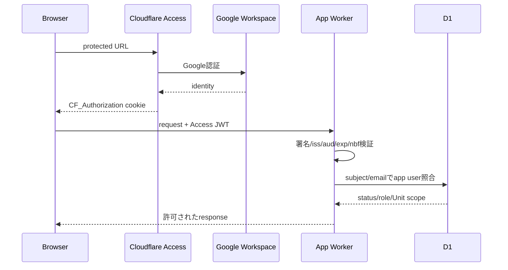

# Phase 3: 認証・RBAC・Unitアクセス制御

## 1. 認証フロー

Google Workspaceは本人認証、Cloudflare Accessは入口保護、アプリは利用許可と業務認可を担当する。Accessを通過しても`app_users`未登録、無効、scopeなしなら403とする。

## 2. JWT検証

- `Cf-Access-Jwt-Assertion`またはAccess cookieのtokenをサーバー側で取得する。
- Cloudflare Accessの公開鍵でRS256署名と`kid`を検証する。
- `iss`は自社team domain、`aud`は環境別application AUDに完全一致させる。
- `exp`、`nbf`、`iat`、token typeを検証し、clock skewを限定する。
- headerやemailだけを信頼しない。
- 検証済み`sub`を第一識別子、正規化済みemailを管理照合に使う。
- previewとproductionのAUD、Access application、許可groupを分離する。

アプリ独自パスワード、OTP、refresh token、Redis sessionは持たない。Access token寿命と再認証はCloudflare Access policyで管理する。requestごとに短命な`Principal`を構築し、server-sideでのみ使用する。

## 3. Roleとcapability

| Capability | SYSTEM_ADMIN | EXECUTIVE | UL |
|---|---:|---:|---:|
| 自分のprofile閲覧 | ✓ | ✓ | ✓ |
| 全Unit/Member閲覧 | ✓ | ✓ | - |
| 自Unit/Member閲覧 | ✓ | ✓ | ✓ |
| Member・所属・状態編集 | ✓（保守時） | - | 自Unitのみ |
| 目標・1on1元データ編集 | ✓（保守時） | - | 自Unitのみ |
| 通常1on1閲覧 | 全Unit | 全Unit | 自Unit |
| 機密1on1閲覧 | 明示ACLのみ | 明示ACLのみ | 作成者/明示ACL |
| AI prepare/approve | 設定権限者は可 | - | 自Unitのみ |
| 全Unitレビュー | ✓ | ✓ | - |
| reviewerコメント・差戻し | ✓ | ✓ | - |
| 制度版管理 | ✓ | 閲覧 | 閲覧・任意link |
| 利用者・role・scope管理 | ✓ | - | - |
| AI model/prompt/cap管理 | ✓ | 閲覧 | - |
| 監査閲覧 | 全件 | 全Unitの許可metadata | 自Unitの許可metadata |
| backup/restore | ✓（限定担当） | - | - |

`SYSTEM_ADMIN`は運用権限であり人事上の上位者を意味しない。同一人物が複数roleを持てるが、権限付与・剥奪を監査する。日常業務でadmin bypassを使わず、保守操作は理由入力を必須にする。

## 4. 認可判定順

1. Access JWTが正しい。
2. app userが`ACTIVE`。
3. endpoint capabilityをroleが持つ。
4. resourceのUnitがactor scope内。
5. resource confidentialityとrecord ACLを満たす。
6. resource stateが操作を許す。
7. field-level policyで返却・変更可能列を絞る。

1つでも失敗すれば処理と外部副作用を開始しない。認可結果はrepository queryにもscope predicateとして渡し、取得後filterだけに依存しない。

## 5. Unit scope

- ULのscopeは`user_unit_scopes`の有効期間で決まる。
- Memberの対象Unitは現在の主所属を基本とするが、過去記録の参照は記録作成時Unitと移管規則を用いる。
- Unit異動時、旧ULは異動日以降の新規編集を失う。過去記録の閲覧は原則失い、業務上必要な移管はSYSTEM_ADMINが個別ACLで行う。
- 兼務UnitのULに自動閲覧権限を与えない。必要なら明示scope/record ACLを期間付きで付与する。
- Executiveのglobal readも機密記録を自動開示しない。

## 6. Field-level制御

一覧APIでは本文、非公開メモ、employee_ref、AI context、share tokenを返さない。Executive reviewには通常記録と確定情報を返し、UL内部メモ、未承認AI推測、機密entryを除外する。監査一覧はevent type、時刻、actor、対象、outcomeまでとし、対象本文を複製しない。

## 7. CSRF・session対策

- mutationはPOST/PATCH/DELETEのみとしGETで状態変更しない。
- `Origin`/`Referer`、Fetch Metadata、許可Content-Typeを検証する。
- Access cookieに加え、アプリ発行の署名付きCSRF tokenをform/headerで照合する。
- CORSは原則同一originだけ。public shareはread-only。
- logoutはAccess logoutへ遷移し、app側の一時draft/CSRF stateを破棄する。
- role/scope無効化は次requestから即時反映し、長期app sessionへcacheしない。

## 8. 手動セットアップ

- Google Workspace IdPをCloudflare Zero Trustへ接続
- production/preview Access applicationとAUD作成
- 利用を許可するWorkspace group/domain policy設定
- 初期SYSTEM_ADMINをD1へ登録
- UL/Executive roleとUnit scopeを二者確認して投入
- 緊急時のAccess停止、user revoke、admin recovery手順を記録

これらはコードで自動完結せず、会社管理者権限が必要な`MANUAL_SETUP`である。
