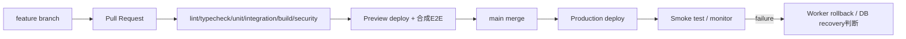

# Phase 3: デプロイ・通知・監視・バックアップ運用

## 1. GitHubからCloudflareへの流れ

production deployはmainだけから行い、GitHubとCloudflareの環境権限を最小化する。previewは本番Access/D1/R2/Secretを参照しない。migrationとWorkerの互換性を確認し、DB変更があるdeployはbackup bookmark、migration、app deploy、smokeの順序とrollback判断をrelease recordへ残す。

## 2. Branch・CI gate

- mainへの直接pushを禁止し、PRを必須にする。
- required checks: format、lint、typecheck、unit、D1 integration、OpenNext build、preview smoke、secret scan、dependency audit。
- migration変更時は空DB適用と前versionからのupgradeを検証する。
- HTML共有template変更時はsnapshot、CSP、情報除外testを必須にする。
- AI Prompt/schema変更時はPhase 2 golden testを実行する。

## 3. 通知・メール

CronはUTCで動くため、applicationがAsia/Tokyoの現在時刻へ変換してdue jobを抽出する。通知はD1 outboxへ作成し、Gmail API adapterが送信する。メール本文は機密内容を含めず、アプリへのAccess保護linkと一般的な件名だけにする。

送信はdedupe keyを用い、成功response IDを保存する。429/5xxは指数backoff、恒久4xxは再試行せず管理者へ一般化した警告を出す。最大試行後はdead状態にし、手動再送を監査する。

### Google Workspace手動設定

- 専用送信アカウント/aliasとFrom方針
- Gmail API有効化、OAuth/service account方式
- domain-wide delegationが必要かの最小権限レビュー
- 送信scope、Secret rotation、退任者に依存しない所有
- SPF/DKIM/DMARCと送信制限確認

既存SMTP adapterを使う場合はport 465/587、TLS、認証、Workers互換性をPoCし、port 25は使用しない。

## 4. Scheduled job

| 頻度 | 処理 |
|---|---|
| 15〜60分 | due reminder、メールoutbox、stuck job再取得 |
| 日次 | 期限切れshare無効確認、retention候補、整合性検査、D1 export |
| 月次 | AI予算月切替、保持report、費用report |
| 半期 | 評価期間snapshot候補、制度版確認。人間lockが必要 |

Cronの重複・遅延を前提に`last_success_at`とdedupe keyを持つ。業務状態をCronだけで自動確定しない。

## 5. Backup・復旧

要件は日次、30日保持、RPO 24時間、RTO 1営業日。

- D1 Time Travelを有効な復旧手段として使用する。
- planが30日Time Travelを満たさない場合、日次D1 exportをPrivate R2へ保存して30日life cycleで削除する。
- R2 object本体、metadata、D1参照の整合を検査する。
- backup prefixはapplication runtimeの通常readから分離する。
- 月1回、合成/preview環境で復旧演習し、所要時間、欠損、手順差分を記録する。
- production復旧はSYSTEM_ADMINの二者確認、影響範囲、restore point、事後検証を必須にする。

復旧runbook:

1. 書込み停止またはmaintenance mode。
2. incident時刻と安全なbookmark/exportを選択。
3. 現状の保全exportを取得。
4. D1 restoreまたは新DBへimport。
5. schema version、件数、主要整合性、R2参照を検証。
6. smoke test後に再開し、監査へ記録。

## 6. Observability

| Signal | 例 |
|---|---|
| availability | request success、latency、5xx、Access拒否急増 |
| application | API error code、conflict、job lag、mail失敗 |
| AI | operation別成功、validation違反、cost、cap率、編集率 |
| security | wrong audience、scope拒否、share token失敗、admin操作 |
| data | orphan、stuck state、backup/export、retention due |

ログはrequest ID、route template、status、duration、actorの非可逆識別、error codeを基本とし、URL raw share token、query、本文、メール、Member名、Prompt、SQL bind値を除外する。正常時の本文debug logを許可しない。

## 7. SLO・alert

初期目標:

- 月間可用性99.5%（計画停止除外）
- 通常API p95 1秒以内を目標。AI外部待機は別計測
- 重大認可漏えい0件、AI PII漏えい0件
- reminder遅延24時間未満
- backup日次成功、restore 1営業日以内

小規模内部アプリのため24/7有人対応を要求しない。重大情報漏えい・認可不具合は即時AI/share停止、その他は1営業日内の確認を基本とする。

## 8. Cost guardrail

- Cloudflare、Google、AIの利用量を月次集計する。
- AIは1,000円相当のapplication capを強制する。
- D1/R2/Workers/Queuesのfree/paid quotaを80%で警告する。
- 予期しないloopを防ぐためCron 1回の処理件数とAI/mail送信数に上限を持つ。
- 有料plan変更、外部AI追加、SMTP/メール有料サービス追加は管理者判断とADRを必須にする。

運用費を0円と断定しない。free tierで開始できても、30日D1 Time Travel、WAF/rate limit、利用増、AI、ドメイン、Google Workspace等に費用が発生し得る。

## 9. Retention job

匿名化対象を日次で`CANDIDATE`化し、自動で即時破壊しない。対象、基準日、関連R2、集計保持内容をSYSTEM_ADMINが確認後に実行する。大量処理はcheckpoint化し、成功後に復元不能性を検証する。監査3年、不採用AI提案、share token、backupの期限はdata class別policyで処理する。

## 10. 公式参照

- [Cloudflare Cron Triggers](https://developers.cloudflare.com/workers/configuration/cron-triggers/)
- [D1 Time Travel and backups](https://developers.cloudflare.com/d1/reference/time-travel/)
- [Cloudflare Queues batching, retries and delays](https://developers.cloudflare.com/queues/configuration/batching-retries/)
- [Google Workspace application mail options](https://support.google.com/a/answer/176600)
- [Gmail API message sending](https://developers.google.com/workspace/gmail/api/guides/sending)
