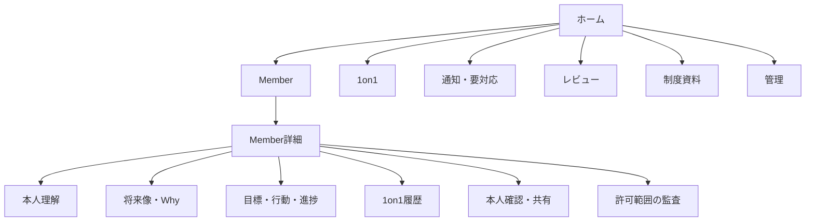
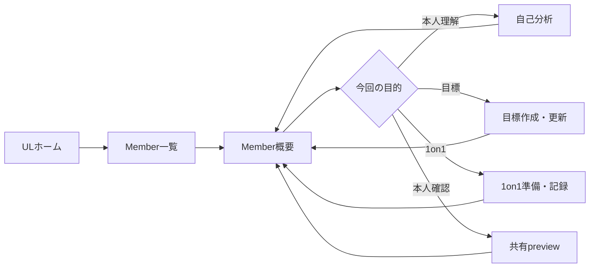

# Phase 4: 情報設計・画面一覧・画面遷移

## 1. UX原則

1. ユーザーに考えさせすぎず、AIに決めさせすぎない。
2. ULの主作業はMember単位に集約し、同じ情報を複数画面へ再入力させない。
3. 本人発言、UL所見、AI推測、AI提案、本人確認済み情報を常に視覚的に区別する。
4. 「未回答」「分からない」「答えたくない」「保留」を正常状態として扱う。
5. 会社制度への接続は任意とし、本人の幸福・生活・キャリアより前面に出さない。
6. AIが停止しても、記録、目標、1on1、本人確認、HTML共有を手動で完了できる。
7. 削除・確定・共有・AI送信・権限変更は結果を確認できる段階を設ける。

## 2. グローバル情報設計

### ナビゲーション

| 領域 | UL | EXECUTIVE | SYSTEM_ADMIN |
|---|---|---|---|
| ホーム | 自Unit | 全Unit概要 | 運用概要 |
| Member | 自Unit閲覧・編集 | 全Unit閲覧 | 全Unit、保守時編集 |
| 1on1 | 自Unit | 通常記録閲覧 | 許可範囲 |
| レビュー | 自分宛対応 | 全Unitレビュー | 全Unitレビュー |
| 制度 | 閲覧・任意link | 閲覧 | 版管理 |
| AI | 自Unitで実行 | 利用量閲覧 | 設定・費用・停止 |
| 管理 | なし | なし | 利用者、Unit、監査、保持、運用 |

roleにないnavigationは非表示にするが、API認可の代替にはしない。兼務roleの場合は利用可能な項目を統合し、現在の操作scopeをheaderに表示する。

## 3. Route・画面一覧

### 共通・認証

| Route | 画面 | 目的 |
|---|---|---|
| `/` | role別ホーム | 要対応、直近1on1、期限、レビューを集約 |
| `/access-denied` | 利用不可 | Google認証済みだが未登録・停止・scopeなしを案内 |
| `/notifications` | 通知一覧 | 期限、未確認、レビュー、運用通知を処理 |
| `/profile` | 自分の情報 | role、Unit scope、最終ログインを確認 |

独自ログイン、招待、OTP、パスワード設定、パスワードリセット画面は作らない。Google Workspace認証はCloudflare Accessへ委譲する。

### UL・Member管理

| Route | 画面 | 主要コンポーネント |
|---|---|---|
| `/members` | 自Unit Member一覧 | 検索、状態filter、要対応、次回1on1、目標状態 |
| `/members/new` | Member登録 | 最小基本情報、主所属、在籍状態 |
| `/members/:id` | Member概要 | 本人中心サマリー、目標、次回行動、1on1、要確認 |
| `/members/:id/profile` | Member・所属履歴 | 主所属、兼務、在籍・休職・退職履歴 |
| `/members/:id/self-analysis` | 本人理解 | 探索テーマ、質問、本人発言、UL所見、未回答 |
| `/members/:id/future` | 将来像・Why | 仮説、確認済み、保留、根拠、納得度 |
| `/members/:id/goals` | 目標一覧 | hierarchy、状態、期限、確認周期、制度link |
| `/members/:id/goals/new` | 目標作成 | 対話型wizard、明確な目標へのshortcut |
| `/members/:id/goals/:goalId` | 目標詳細 | Why、SMART、行動、証拠、進捗、変更履歴 |
| `/members/:id/goals/:goalId/edit` | 目標新版 | 変更理由、差分、本人再確認 |
| `/members/:id/one-on-ones` | 1on1一覧 | 予定、実施、未整理、次回日 |
| `/members/:id/one-on-ones/new` | 1on1準備・実施 | 差分、質問候補、メモ、機密区分 |
| `/members/:id/one-on-ones/:id` | 1on1詳細 | 事前、原メモ、整理案、合意、次回行動 |
| `/members/:id/share` | 本人確認・共有 | snapshot preview、確認記録、token発行・失効 |
| `/members/:id/audit` | Member監査 | ULに許可されたmetadataのみ |

### EXECUTIVE

| Route | 画面 | 目的 |
|---|---|---|
| `/overview` | 全Unit概要 | 運用状態、確認待ち、長期未更新、レビュー状況 |
| `/units` | Unit一覧 | 比較、filter、Member数、運用指標 |
| `/units/:id` | Unit詳細 | Member状態、通常記録、レビュー履歴 |
| `/reviews` | レビュー受信箱 | 未確認、差戻し対応、確認済み |
| `/reviews/:id` | レビュー詳細 | 元データを変えずコメント・差戻し・確認 |

EXECUTIVE画面では「編集」ではなく「コメント」「差戻し」「確認済み」を主要actionにする。機密記録は件数も必要以上に見せず、「権限がない記録が存在する」ことの露出を最小化する。

### SYSTEM_ADMIN

| Route | 画面 | 目的 |
|---|---|---|
| `/admin` | 管理概要 | 利用者、AI費用、job、backup、security警告 |
| `/admin/users` | 利用者・role・scope | ACTIVE停止、role、Unit割当、履歴 |
| `/admin/units` | Unit管理 | Unit版、統合・分割・status |
| `/admin/policies` | 制度資料 | 個人評価とUL Missionを分離して版管理 |
| `/admin/policies/:id` | 制度版詳細 | 適用期間、項目、draft、checksum |
| `/admin/ai` | AI管理 | operation、model policy、prompt版、月額cap、停止 |
| `/admin/audit` | 監査 | scope付きevent検索、本文非表示 |
| `/admin/retention` | 保持・匿名化 | candidate確認、影響、実行、結果 |
| `/admin/operations` | 運用 | job、mail、backup、復旧テスト、quota |

## 4. Member詳細の情報優先順位

画面上部から順に以下を表示する。

1. 氏名、Unit、在籍状態、最終更新、次回1on1。
2. 本人の希望・大切にしたいこと・将来像。未確認の場合は明示。
3. 現在の目標、次の行動、期限、障害。
4. 本人確認待ち、レビュー対応、未完了等の要対応。
5. 最近の進捗・成果・1on1差分。
6. 必要な場合だけ制度との関連。

会社KPI、退職率、評価制度を本人の幸福・将来像より上に配置しない。

## 5. 画面遷移

### 日常利用

### Browser back・deep link

wizard各stepはURLまたはdraft stateを持ち、reload・backで入力を失わない。認可失効時は内容を表示せず、保存していない機密本文をclient storageへ永続化しない。deep linkでも必ずserver認可を行う。

## 6. Layout・responsive

- 主要利用はPCを想定し、最大content幅と読みやすい行長を設定する。
- 1280px以上ではsidebar + main、狭い画面ではnavigation drawerへ変える。
- tableは列を無理に縮めず、重要列をcard化または水平scrollし、操作列を見失わせない。
- wizard、1on1メモ、共有previewはtabletでも利用可能にする。
- hoverだけに情報や操作を置かない。

## 7. Status表示

色だけで表さず、label・icon・説明を併用する。例:

- `本人確認待ち`
- `本人確認済み`
- `AI提案・未承認`
- `UL所見`
- `機密`
- `AI送信不可`
- `制度draft`
- `AI停止中・手動利用可`

「停滞」「期限超過」を人物評価の赤点のように表示せず、「確認が必要」「期限を過ぎています」と事実ベースで表現する。
