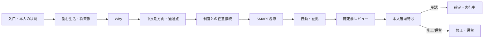

# Phase 4: UL・Member支援・目標形成UX

## 1. 前提

MVPではMember本人はログインしない。ULが本人との対話を記録し、本人は1on1中の画面提示、本人確認HTML、期限付き共有URL、ダウンロード・印刷物で確認する。「Member UX」は本人向けアカウント画面ではなく、ULとの共同確認体験として設計する。

## 2. ULホーム

ホームは「管理指標」より「今日の支援」を優先する。

### 主要領域

- 直近7日間の1on1
- 本人確認待ち
- 期限・中間確認が近い行動
- 前回から更新がない目標
- 未対応レビュー
- AI費用80%/停止、メール障害等の利用影響

Member ranking、意欲スコア、離職予測、評価順位は表示しない。

## 3. Member一覧

表示列:

- Member名、主所属、在籍状態
- 次回1on1
- 現在目標の状態
- 次の確認日
- 本人確認待ち件数
- 要対応理由

filter:

- 在籍/休職/退職/対象外
- 目標なし/下書き/本人確認待ち/実行中/保留
- 1on1予定/未実施
- 要レビュー

「目標なし」を警告色で責めず、`探索を開始`、`現状維持を記録`、`後日確認`のactionを出す。

## 4. 自己理解対話

### 画面構成

1. 今回扱うテーマと本人の同意範囲。
2. 直近の質問と回答欄。
3. 本人発言、UL所見、AI仮説の別入力・別表示。
4. 過去回答の関連候補。
5. 次の質問候補。
6. `答えたくない`、`分からない`、`保留`。

一度に1〜3問だけ表示する。回答保存後、AIを使うかULが手動で次問を選ぶ。AI質問は`AI提案`badge、提案理由、使用した根拠を表示し、編集してから本人へ尋ねられる。

## 5. 目標作成入口

最初に以下から選択する。

| Route | 説明 |
|---|---|
| `じっくり探索する` | 経験・価値観・望む生活から開始 |
| `方向性を整理する` | 曖昧な希望からWhy・通過点を探る |
| `明確な目標から始める` | 目標・Why・期限を直接入力し不足だけ確認 |
| `今は目標を作らない` | 維持したい状態と再確認日だけを記録 |

入口は後から変更でき、shortcutを選んでも本人中心確認とSMART gateは省略しない。

## 6. 対話型目標wizard



各stepは以下を持つ。

- 何を確認するstepかを1文で説明。
- 本人の言葉を最初に表示。
- AI案は別cardで表示し、checkbox一括採用を既定にしない。
- `保存して後で続ける`。
- 現在位置と残りstep。回答数ではなくテーマ単位で示す。
- 必須でない内容を明記。

## 7. Why UX

Why画面は次の列を分ける。

- 本人の言葉
- 関連する経験
- 関連する価値観・将来像
- AIが考えた仮説
- 本人へまだ確認していない点
- 本人の納得度と確認日

AI仮説を本人のWhy入力欄へ自動コピーしない。ULが採用した案も`本人確認待ち`として保存し、本人が自分の言葉へ直せるようにする。

## 8. 制度接続UX

stepの既定は`接続しない`ではなく`必要な場合だけ確認する`とし、skipできる。候補を出す場合は次を表示する。

- 制度の種別（個人評価 / UL Mission）
- 制度版・適用期間
- `draft`かどうか
- 目標との関係候補
- 本人の成長にどう役立つ可能性があるか
- `関連付けない`選択

Management draft KPIは通常候補に出さない。本アプリが正式評価を決定しない注意を制度画面とlink画面へ表示する。

## 9. SMART UX

```text
Specific   OK / 要改善 / 不足
Measurable OK / 要改善 / 不足
Achievable OK / 要改善 / 不足
Relevant   OK / 要改善 / 不足
Time-bound OK / 要改善 / 不足
```

各軸cardに以下を表示する。

- 現在の判定と短い理由
- 根拠となった本人入力
- 何を補えばよいか
- 本人へ尋ねる質問候補
- ULが手動修正する欄

色だけで判定せず、iconとtextを併用する。合計点・合格点を主要表示にしない。不足時は該当stepへ戻れる。合理的例外では理由、代替確認方法、再確認日を入力し、例外を隠さない。

## 10. 確定前レビュー

1画面で以下を確認する。

- 本人が望む目標か
- 本人の言葉によるWhy
- 将来像・生活との接続
- 制度接続の有無と意味
- SMART各軸
- 期限、達成基準、次の行動
- AI提案が未確認のまま混入していないか
- 本人向けHTMLに含まれる内容

`目標を確定`buttonは本人確認前には表示せず、`本人確認用snapshotを作成`とする。

## 11. 本人確認UX

ULが本人と確認後、次を記録する。

- 方法: 1on1画面提示 / 期限付きURL / ダウンロード・印刷
- 日時
- 結果: 承認 / 修正希望 / 保留
- 本人の言葉
- 修正内容
- 記録UL

承認時だけ`本人確認済み`へ進める。URLが閲覧された事実だけを本人承認とみなさない。

## 12. 進捗・変更・完了

進捗入力は「状態」「事実」「本人自己評価」「成果・証拠」「障害」「次の確認」を分ける。期限超過時は変更を促すが失敗扱いしない。

目標変更では旧版と新版の差分を表示し、変更理由と本人再確認を必須にする。完了時は成果、学び、感情、Whyへの寄与を振り返り、`次目標を作る`だけでなく`継続`、`休止`、`探索`を選べる。

## 13. Autosave・離脱

- 長い入力は明示保存に加えて安全なdraft autosaveを行う。
- `保存中/保存済み/失敗`を表示する。
- 機密本文をlocalStorageへ平文保存しない。
- 未保存で画面を離れる場合は警告する。
- 409競合時は自動上書きせず、最新値・自分の変更・差分を提示する。
