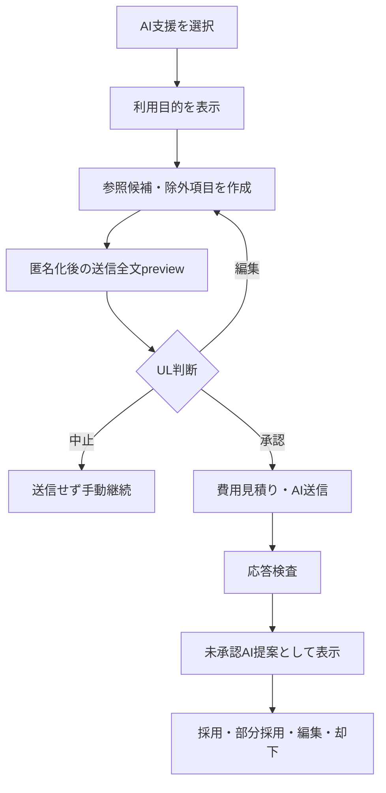

# Phase 4: AI対話・1on1・本人共有UX

## 1. AI利用の共通フロー

AI buttonを押して即送信しない。すべての操作は以下を通る。

## 2. 送信前preview

### 必須表示

- AI操作名と目的
- 送信先provider/model alias。具体名未確定時は`PoC選定モデル`
- 今回の送信予定全文
- 置換した種類と件数
- 送信から除外した記録
- `AI送信不可`が含まれていないこと
- 推定token・概算費用・当月残額
- 学習不使用・保持条件の確認状態
- 送信後にAIができること / できないこと

### 操作

- 匿名化後本文を編集
- 元情報との対応を画面内だけで確認
- 再検査
- 承認して送信
- 中止して手動へ戻る

原文と匿名化文の対応表示は第三者に見られない配置にし、screen share時の注意を表示する。匿名化対応表をcopy/downloadさせない。

## 3. AI処理中・失敗

- 進行中は操作名と中止可否を示し、人物評価をしているような表現を避ける。
- timeoutでもdraftを失わない。
- 予算上限時は`AI支援は今月停止中です。手動入力は利用できます`と表示する。
- provider障害時は再試行を強要せず、手動templateを開く。
- 自動retryが行われる場合は同一payloadで最大1回であることを示す。
- 未承認draftを復旧後に自動送信しない。

## 4. AI出力card

各提案に次を表示する。

- `AI提案・未承認`
- 提案内容
- 使用した確定情報の参照
- 推測・不明点
- 警告
- 採用、部分採用、編集して採用、却下

一括採用をprimary actionにしない。採用時は対象フォームに差分previewを出し、人間所有データとして保存する。AI提案card自体のbadgeを`本人確認済み`へ変えない。

## 5. 1on1準備画面

画面順:

1. 前回からの確定差分
2. 目標・行動・期限・未完了
3. 本人確認待ち
4. 最近の成果・障害
5. AI事前サマリーを生成するoptional action
6. 質問候補の選択・編集・並べ替え
7. 今回のテーマとUL支援候補

AIを使わなくても各sectionを手動で入力できる。`停滞`等のAI表現は事実と質問へ変換し、人物評価として見せない。

## 6. 1on1実施画面

- 左または上: 今回のテーマと選択済み質問
- 中央: 本人発言・合意事項のメモ
- 補助: 目標・前回行動・成果
- 各entry: 本人発言 / UL所見、通常 / 機密 / AI送信不可
- footer: 次の行動、UL支援、次回確認日

MVPでは録音、文字起こし、AIのリアルタイム評価を行わない。対話中にAI提案を画面の主役にせず、ULとMemberの会話を妨げない。

## 7. 1on1事後整理

1. 原メモを保存。
2. 機密・AI送信区分を確認。
3. AIを使う場合は匿名化preview。
4. AI整理案を本人発言、事実、課題、障害、合意、次行動、UL支援、未確認へ分離表示。
5. ULが原文と並べて修正。
6. 本人と合意した項目だけ`合意済み`へ変更。
7. 次回確認と通知を設定。

AI整理案を原メモへ上書きしない。原メモ、整理案、人間確定の3つを追跡できる。

## 8. 本人向けHTML preview

含められるsection:

- 本人確認済みの将来像・Why・目標
- SMART結果と例外理由
- 行動、進捗、成果・証拠、振り返り
- 本人と合意した1on1内容
- 本人が理解した制度接続
- 作成日時、対象version、問い合わせ先

除外previewも表示する。

- 未承認AI推測
- UL内部メモ
- 人事判断用メモ
- 機密で共有対象外の記録
- 監査ログ
- 他Member情報

ULは生成前と生成後の両方でpreviewする。共有snapshotは不変で、後の目標更新を自動反映しない。

## 9. 共有・ダウンロード

### 共有URL発行

- 既定7日、最大30日
- 有効期限の日時を明記
- 発行後にraw tokenを再表示しない
- copy成功を通知
- 即時失効button
- 発行者、発行日、初回閲覧、最終閲覧、失効状態

### Public共有画面

- 認証不要だがtokenを持つ本人だけが閲覧する前提を明記
- Member名を必要以上にpage titleへ出さない
- 印刷・HTML download
- 有効期限と内容version
- 検索・cache・外部resourceなし
- 期限切れ・失効は内容を一切表示しない

URL閲覧は本人確認ではない。確認結果はULが別画面で記録する。

## 10. Share失敗UX

| 状態 | 表示 |
|---|---|
| 期限切れ | `この共有リンクの有効期限は終了しました` |
| 失効 | 同一の一般表示。理由・対象者を漏らさない |
| 不正token | 内容の存在を明かさない一般表示 |
| snapshot生成失敗 | ULへ再生成と手動HTML downloadを案内 |
| R2障害 | request IDと後日再試行。Member情報をerrorへ含めない |

## 11. Notification UX

通知対象は行動予定、中間確認、振り返り、1on1、SMART再確認、目標期限、更新、未回答、レビュー、AI/運用障害。通知は同日同Memberでまとめ、優先度と期限で並べる。

メールには機密本文や目標内容を書かず、`確認が必要な項目があります`等の一般文とAccess保護されたlinkだけを含める。既読、スヌーズ、停止、周期変更を用意し、期限超過を評価表現にしない。
